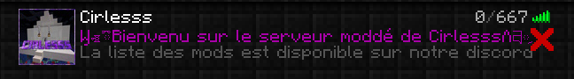
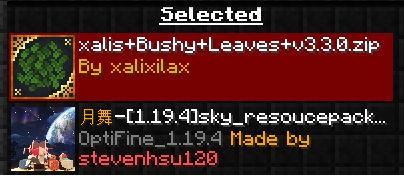

  Serveur moddé Cirlesss 1.19.4

  Pour vous connecter à ce serveur il vous faut 
-   Télécharger Java
-   Avoir minecraft (voici un lien d'une version cracké https://tlauncher.org/en/)
-   Télécharger Forge 1.19.4 
-   Délplacer dans "C:\Users\VotreUtilisateur\AppData\Roaming\.minecraft" le dossier "ressourcepacks" et "mods"
-   Avant de lancer le jeu il est préférable de configurer au minimum 4gb de ram pour rejoindre le serveur
-   Pour obtenir l'IP il suffit de me contacter sur Discord !

  Une fois dans le jeu il est recomandé de mettre dans cet ordre les pack de textures

  Voila c'est fini bon jeu !

